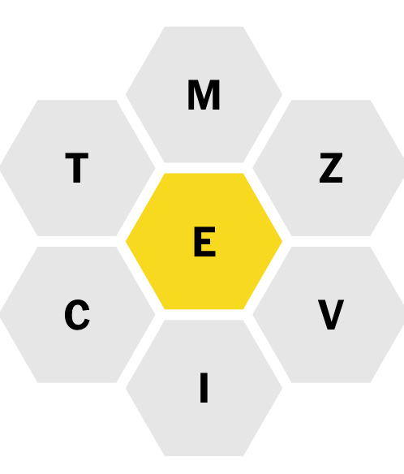

# 2024-04-16

## Problem overview

You are given a _bee_ of seven letters: a _central letter_ surrounded by six others. For example:



The goal is to find the seven (six plus one) letters (that themselves make a _pangram_) which score the fewest points
(see below).

## Rules and scoring

- The _central letter_ must be present in all words created from the bee (_sub-words_)
    - In the example above, the letter "e" must be present in all sub-words
- Letters can be used more than once
- Words must be at least four letters long
- The letter "s" is never present in a bee
- Points:
    - Four-letter words: 1
    - One point per letter for five-letter and above

## Approach

I have never actually played this puzzle before. My understanding of the problem is that it is not enough just to
generate a list of possible of sub-words from a word - we need to look at each word with each of its possible central
letters. E.g., `aardwolf` will score much more highly if `a` is the central letter rather than `w`.

I have read conflicting opinions about whether a bee needs to form a _perfect_ pangram (the letters in the bee must form
a valid seven-letter word where each letter is used once) to be valid or if an imperfect pangram (the letters in the bee
form a valid word of at least seven letters with each letter being used at least once) will suffice. I have opted with
the latter.

### Steps

- Get a list of words - the Scrabble dictionary will do
- Filter word list for words that have seven unique letters and no "s" - i.e., viable bee-shaped combinations of
  unique letters
- Also create a list of at-least-four-letter words without the letter "s" - this will be our list of all possible
  sub-words
- For each of these at-least-seven-letter words, generate a list of each combination when the central letter takes a
  different value
    - It is not enough just to check each word
    - We need to check each bee with each of its possible central letters (the letter that _must_ be present in each
      sub-word)
    - For each tuple representing this combination, retain the original word (for readability and posterity) -
      e.g., `[aardwolf \a dflorw]`
- Combine this list of every word in list of words to create a flat list of these combinations
    - E.g., if our word list consisted of `aardwolf` and `equivoke`, the list of combinations would be:
  ```text
  (["aardwolf" \a "dflorw"]
   ["aardwolf" \r "adflow"]
   ["aardwolf" \d "aflorw"]
   ["aardwolf" \w "adflor"]
   ["aardwolf" \o "adflrw"]
   ["aardwolf" \l "adforw"]
   ["aardwolf" \f "adlorw"]
   ["equivoke" \e "ikoquv"]
   ["equivoke" \q "eikouv"]
   ["equivoke" \u "eikoqv"]
   ["equivoke" \i "ekoquv"]
   ["equivoke" \v "eikoqu"]
   ["equivoke" \o "eikquv"]
   ["equivoke" \k "eioquv"])
  ```
- For each tuple in the list, use a basic regex pattern to match on words from the list of all possible sub-words
- Calculate the score for each sub-word
    - Sum the scores for all sub-words for each tuple
    - Use the above information to build up a map of tuple->words and score - e.g.,
      ```text
      {["aardwolf" \w "adflor"] {:words ["aardwolf"
                                         "allow"
                                         "alow"
                                         "arrow"
                                         "award"
                                         "awol"
                                         "draw"
                                         "drawl"
                                         "dwarf"
                                         "fallow"
                                         "farrow"
                                         "flaw"
                                         "flow"
                                         "follow"
                                         "foofaraw"
                                         "forward"
                                         "fowl"
                                         "frow"
                                         "froward"
                                         "waff"
                                         "wall"
                                         "walla"
                                         "wallaroo"
                                         "wallow"
                                         "ward"
                                         "warlord"
                                         "wawl"
                                         "woad"
                                         "woald"
                                         "wold"
                                         "wolf"
                                         "wood"
                                         "woof"
                                         "wool"
                                         "word"
                                         "world"]
                                 :score 127}}
      ```
- Use this map to construct a priority map (with the help of the non-core `org.clojure/data.priority-map` library)
    - This allows us to have a map that is sorted by value rather than key
    - We pass a custom a comparator function to the priority map-constructing function that allows us to reach into each
      value in our original map and pull out the `:score` for comparison
- Grab the first entry in the priority map!

## Result

```shell
time clojure -M -m _202240416.bee
```

```shell
The word-central letter combination with the lowest score is: princox, x (7).

The valid sub-words for this combination are: princox.

"Elapsed time: 3678746.998083 msecs"
clojure -M -m _202240416.bee  3720.86s user 21.09s system 101% cpu 1:01:19.57 total
```

## Possible improvements

### Narrowing search space

- Filtering out vowels as potential central letters from the tuples representing the permutations (assumption:
  having a consonant as the central letter will never result in a higher score)

### Reducing memory usage

- Keeping track of the lowest score seen so far and discarding bees that are not lower, probably implemented with a
  tail-recursive function
    - This approach could also be done at the level of each word - i.e., only store the word's worst-performing central
      letter

## References

- [London Clojure Dojo @ uSwitch, 2024-04-16](https://www.meetup.com/london-clojurians/events/298438545/)
- [Bill Mill's blog](https://notes.billmill.org/blog/2024/03/What_are_the__worst__spelling_bee_pangrams_.html)
- [Getting to Genius, Part 1: Spelling Bee for Beginners (New York Times)](https://www.nytimes.com/2023/09/11/crosswords/getting-to-genius-part-1.html)
- [Scrabble word list from (GitHub)](https://github.com/raun/Scrabble/blob/master/words.txt)
